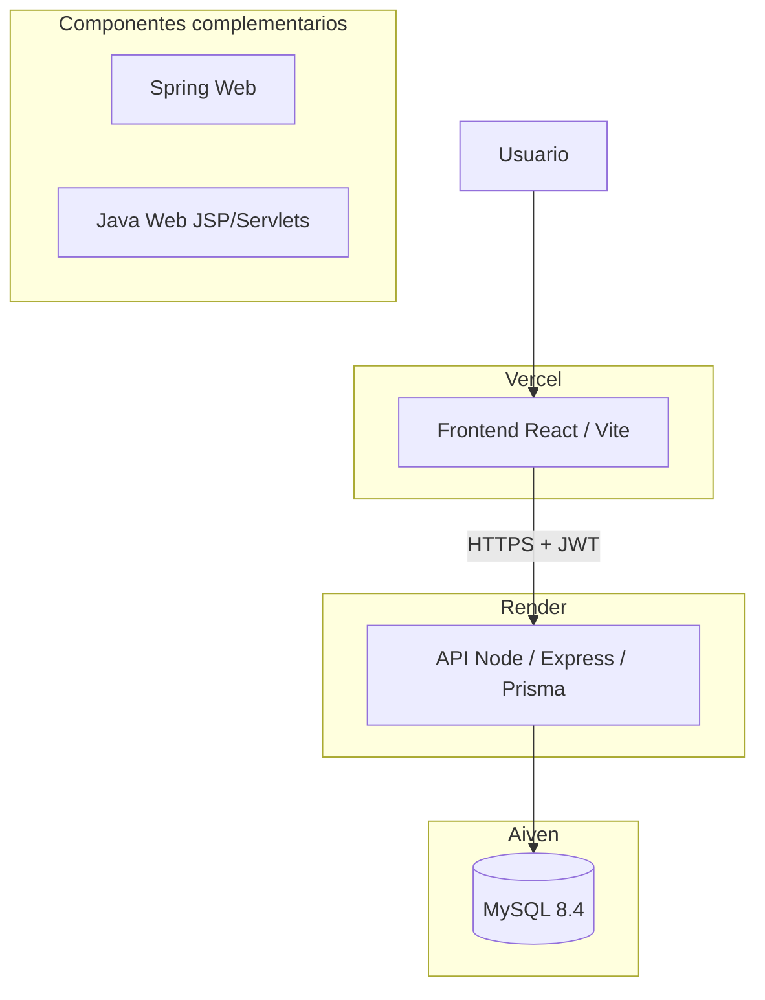

# MLBT - María La Bonita Taquería

Plataforma full-stack para la gestión administrativa de María La Bonita Taquería: panel web, API REST, validación automatizada y despliegue en Vercel y Render.

[](https://github.com/borikano/MLBT_Proyecto/actions/workflows/ci.yml)


## Demo / endpoints

| Recurso | URL | Verificación (2026-08-16) |
|---|---|---|
| Frontend | https://mlbt-proyecto.vercel.app | HTTP 200 |
| Login | https://mlbt-proyecto.vercel.app/login | HTTP 200 |
| API | https://mlbt-proyecto.onrender.com | HTTP 200 |
| Health | https://mlbt-proyecto.onrender.com/api/health | HTTP 200 |

Las credenciales de validación se gestionan fuera del repositorio. El acceso autenticado al dashboard no se verifica en documentación pública.

## Descripción del producto

MLBT centraliza operaciones administrativas de la taquería: autenticación, panel de control, usuarios, inventario y ventas. El frontend React consume la API Node sobre MySQL; los módulos Java (Spring Web y Java Web) son complementarios de referencia y no forman el backend productivo principal.

## Funcionalidades principales

| Área | Capacidades |
|---|---|
| Autenticación | Login JWT contra API Node, rutas protegidas en frontend |
| Dashboard | Panel administrativo con métricas y accesos rápidos |
| Usuarios | Resumen, creación, listado y gestión de roles |
| Inventario | Registro, movimientos, tablas y control de existencias |
| Ventas | Pedido actual, historial y análisis |
| API | Endpoints REST con validación de entrada (Zod), health público |
| Calidad | Runtime productivo principal: 137/137 pruebas (74 Frontend + 63 API), lint, build, check y CI |

## Arquitectura



## Stack tecnológico

Versiones declaradas en `package.json`, `pom.xml` y lockfiles:

| Capa | Tecnologías |
|---|---|
| Frontend | Node 24.x, pnpm 11.0.8, React ^19.2.8, Vite ^8.1.5, Vitest 4.1.10, react-router-dom 7.18.1, TanStack Table 8.21.3, Tailwind CSS 4.3.3 |
| API | Node 24.x, pnpm 11.0.8, Express 5.2.1, Prisma 6.19.3, JWT, Zod |
| Datos | MySQL 8.4 (Aiven en producción) |
| Java complementario | Spring Boot 4.1.0 (Java 17), Java Web WAR (Java 11), JUnit 6.1.2 |
| Calidad | GitHub Actions, Dependabot, ESLint |

## Validación de calidad

### Pruebas automatizadas

| Módulo | Resultado |
|---|---|
| Frontend React | 74/74 |
| API Node | 63/63 |
| Spring Web | 3/3 (registro histórico) |
| Java Web | 3/3 (registro histórico) |
| **Runtime productivo principal** | **137/137** |

### Frontend

- ESLint: PASS
- Build de producción: PASS
- Chunk entry actual: **246.35 kB** (gzip **79.02 kB**)
- Carga diferida por rutas (`React.lazy` / `Suspense`)
- Sin warning Vite >500 kB en la última validación

### Java Web

- Procedimiento local: `test.cmd` y `package.cmd`
- WAR generado correctamente
- Maven global no requerido para el flujo local documentado

> Referencia de calidad: ISO/IEC 25010 se utiliza como modelo de referencia, no como certificación.

## Instalación y ejecución local

### Frontend

```powershell
Set-Location ".\01_FRONT_END\01_REACT_AP07"
pnpm install
pnpm dev
```

Local: http://localhost:5173

### API Node

```powershell
Set-Location ".\02_BACK_END\01_API_NODE"
pnpm install
pnpm run dev
```

Local: http://localhost:3001 — requiere MySQL local y variables en `.env.example`.

### Spring Web

```powershell
.\02_BACK_END\02_SPRING_WEB\mvnw.cmd -f .\02_BACK_END\02_SPRING_WEB\pom.xml spring-boot:run
```

Local: http://localhost:8082

## Pruebas y validación

```powershell
# Frontend
Set-Location ".\01_FRONT_END\01_REACT_AP07"
pnpm test:run
pnpm lint
pnpm build

# API
Set-Location ".\02_BACK_END\01_API_NODE"
pnpm test
pnpm check

# Spring Web
.\02_BACK_END\02_SPRING_WEB\mvnw.cmd -f .\02_BACK_END\02_SPRING_WEB\pom.xml test

# Java Web
.\02_BACK_END\03_JAVA_WEB\test.cmd
.\02_BACK_END\03_JAVA_WEB\package.cmd
```

## Despliegue

| Componente | Plataforma | URL |
|---|---|---|
| Frontend React | Vercel | https://mlbt-proyecto.vercel.app |
| API Node | Render | https://mlbt-proyecto.onrender.com |
| Base de datos | Aiven MySQL 8.4 | Variable de entorno segura en Render |

Secretos, tokens y cadenas de conexión no se versionan. Configuración mediante variables de entorno en cada plataforma.

> Prisma se mantiene en la línea 6.x. La migración a Prisma 7 requiere ajuste explícito del datasource y validación de conexión real.

> **Condición operativa:** Vercel, Render y Aiven conforman la arquitectura pública vigente. Las limitaciones propias de los planes utilizados, como un posible cold start en Render, se documentan como condición operativa y no se presentan como un SLA empresarial.

## Seguridad

- Política: [SECURITY.md](SECURITY.md)
- Estándares y controles: [03_DOCS/seguridad-pruebas-calidad.md](03_DOCS/seguridad-pruebas-calidad.md)
- `.env` no versionado; plantillas en `.env.example`
- CORS, JWT y validación de entrada documentados en la API

## Estructura del repositorio

| Ruta | Propósito |
|---|---|
| [01_FRONT_END/01_REACT_AP07](01_FRONT_END/01_REACT_AP07) | Frontend administrativo (productivo) |
| [02_BACK_END/01_API_NODE](02_BACK_END/01_API_NODE) | API REST principal |
| [02_BACK_END/02_SPRING_WEB](02_BACK_END/02_SPRING_WEB) | Módulo Spring Boot complementario |
| [02_BACK_END/03_JAVA_WEB](02_BACK_END/03_JAVA_WEB) | Módulo Java Web complementario |
| [01_FRONT_END/02_INTERFAZ_BASE](01_FRONT_END/02_INTERFAZ_BASE) | Prototipo estático histórico |
| [00_GUIA_TECNICA_PROYECTO](00_GUIA_TECNICA_PROYECTO) | Documentación técnica del proyecto |
| [03_DOCS](03_DOCS) | Estándares, seguridad e historial documental |

## Documentación técnica

| Documento | Contenido |
|---|---|
| [Guía técnica](00_GUIA_TECNICA_PROYECTO/README.md) | Índice y panel de revisión |
| [Comandos](00_GUIA_TECNICA_PROYECTO/03_COMANDOS_DE_EJECUCION.md) | Ejecución y validación |
| [Validación y pruebas](00_GUIA_TECNICA_PROYECTO/05_EVIDENCIAS_Y_PRUEBAS.md) | Matriz QA y comandos |
| [Estado técnico](00_GUIA_TECNICA_PROYECTO/07_CIERRE_TECNICO.md) | Consolidación del proyecto |
| [Frontend](01_FRONT_END/01_REACT_AP07/README.md) | Módulo React |
| [API](02_BACK_END/01_API_NODE/README.md) | Módulo Node |
| [Historial documental](03_DOCS/evidencias/README.md) | Registros históricos (archivo) |

## Mantenimiento y dependencias

- **CI:** workflow `CI` en push y pull request (Node 24, pnpm 11.0.8, Java 17, Maven).
- **Dependabot:** actualizaciones semanales; majors de Prisma bloqueados en CI.
- **Ejecución CI:** cada candidato se valida en GitHub Actions después del push; el README no fija un HEAD efímero como estado permanente.

## Historial de mejoras técnicas

### Optimización del bundle frontend

- Carga diferida por rutas con `React.lazy` y `Suspense`
- H-001 histórico: chunk entry 509.80 kB → **256.26 kB**
- H-001 histórico: gzip 151.23 kB → **80.77 kB**; baseline PROD-001 actual: **79.02 kB**
- Warning Vite >500 kB resuelto

### Reproducibilidad Java Web

- Scripts `test.cmd` y `package.cmd` como interfaz canónica
- Reutilización del Maven Wrapper de Spring Web
- 3/3 pruebas JUnit en flujo local documentado

## Licencia

Distribuido bajo [MIT License](LICENSE.md). Los datos de prueba deben mantenerse anonimizados.
